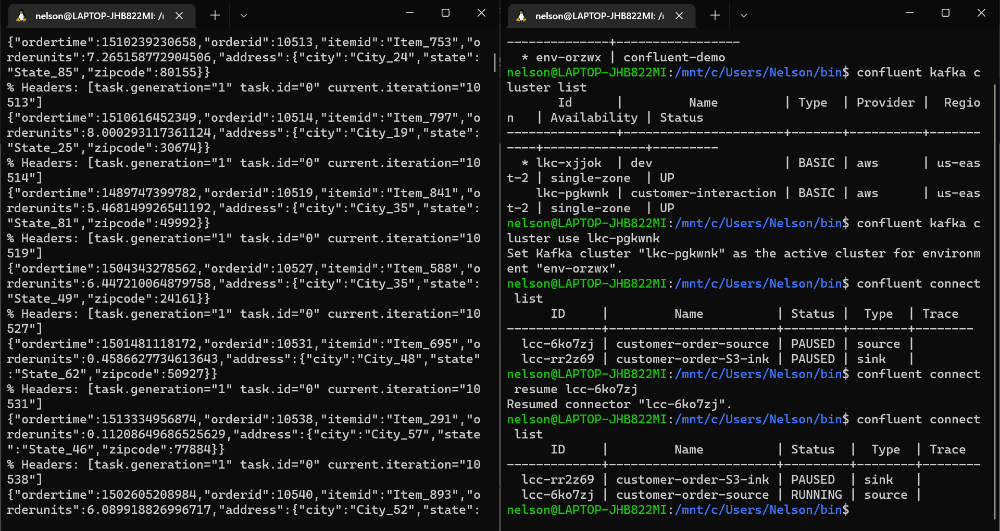
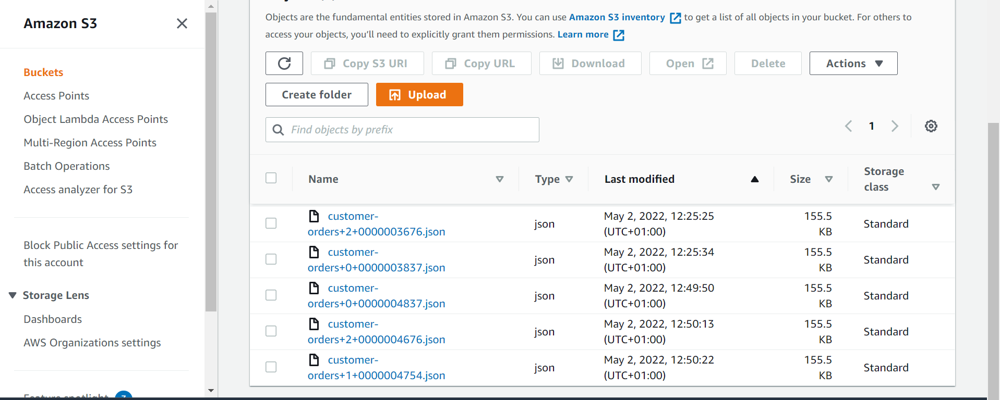
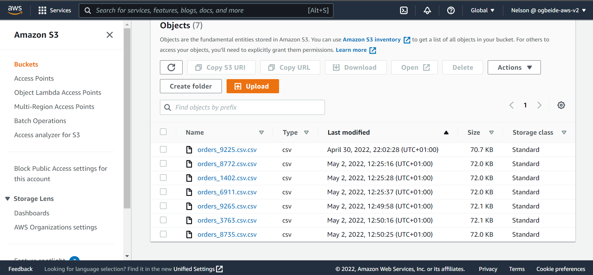
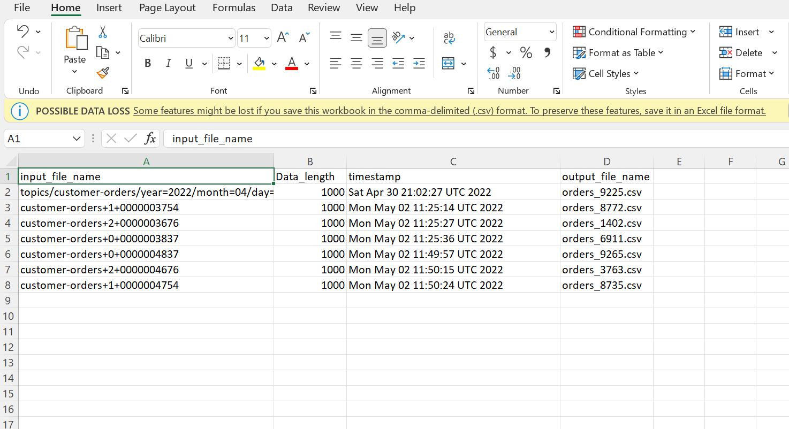

# kafka-and-lambda-data-pipeline

## Overview 
In this project, i created a streaming data pipeline with kafka using confluent cloud which is a fully managed apache kafka service.  i also explored aws lambda (a servelerless event driven compute service). Kafka streams the messages produced by datagenconnector, S3connector consumes the message and stores it in an s3 bucket, Lambda function to clean and process the raw data is triggered by eventbridge on the rule of object created, and finally this clean data is stored in an s3 bucket while recording the runs. 

## About
I created a topic with 3 paritions, a source connector being DATAGENCONNECTOR provided by confluent to pull "order data" and a Sink connector being AWS S3 as the data lake tonsume data from the topic which is stored in a json format. I created a lambda function to fix data schema and convert json to a dataframe then save as csv for more appropriate use. I created an event bridge trigger to invoke the lambda function whenever an object is created in that s3 bucket (i.e whenever the sink connector(AWS S3) consumes messages). 

## Infrastructure
I used terraform , an open source Iac (Infrastructure as a code) service to create the AWS data infrastructure which took care of IAM permisions, creating the lambda function, adding a custom layer to lambda, creating and attaching eventbridge to the lambda function

## Tools 
1. Confluent kafka
2. S3
3. LAMBDA
4. Eventbridge
5. python
6. Terraform

## Result
1. This image shows the connectors Datagen(Source connector) and S3Connector(Sink Connector) as well as the the messages being consumed by kafka 

2. This image shows the raw data produced in an s3 bucket

3. This image shows the processed data in an s3 bucket

4. This image shows the record of each run
